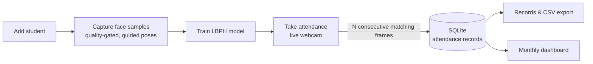

<div align="center">

# 🎓 Face Recognition Attendance System

**Point a webcam at a classroom and attendance marks itself.**

A desktop app to register students, capture face samples, train a recognizer and take attendance automatically, with records, CSV export and a monthly analytics dashboard.

[](https://github.com/gmgowrish/Face-Recognition-in-Python-Project/actions/workflows/python-package.yml)


</div>

---

## ✨ Features

| | Feature | Details |
|---|---|---|
| 👤 | **Student management** | Add and delete students (roll no., name, department, …) |
| 📸 | **Smart face capture** | Auto-captures samples only when the frame passes a quality gate (face big enough, both eyes open, not blurry) and guides a pose sequence (straight, left, right, chin up/down). Warns if a face already matches another student. |
| 🧠 | **One-click training** | Trains an OpenCV LBPH recognizer on a background thread |
| ✅ | **Live attendance** | A face must match the same student for several consecutive frames before it is marked present, which filters blinks and noisy frames |
| 🗂️ | **Records & export** | Filter by date range, see the photo taken when attendance was marked, export to CSV |
| 📊 | **Monthly dashboard** | KPIs, daily trend, day-of-week pattern, department breakdown and a sortable per-student roster |
| 🐳 | **Docker support** | `run.sh` builds and runs the GUI in a container with camera and X11 passthrough |
| 🧪 | **Tested** | `pytest` suite for the engine and service layers, run on Python 3.10–3.12 in GitHub Actions |

---

## 🔄 How it works



Faces are detected with a Haar cascade, histogram-equalized to reduce lighting differences, and recognized with **LBPH (Local Binary Patterns Histograms)**. The match threshold uses LBPH's raw distance, where lower means a closer match.

---

## 🚀 Getting Started

The app lives in [`pythonProject2/`](pythonProject2).

### Prerequisites
- Python **3.10+**
- A webcam

### Install & run

```bash
git clone https://github.com/gmgowrish/Face-Recognition-in-Python-Project.git
cd Face-Recognition-in-Python-Project/pythonProject2

python -m venv .venv
source .venv/bin/activate        # Windows: .venv\Scripts\activate
pip install -r requirements.txt

python main.py
```

You don't need a database server. Everything is stored in a local `data/` folder created on first run:

```
data/
├── attendance.db      # students + attendance records (SQLite)
├── faces/             # captured face samples
└── classifier.xml     # trained model
```

### Run with Docker (Linux / X11)

```bash
./run.sh start    # build if needed and start in the background
./run.sh logs     # follow output
./run.sh stop
```

### Run the tests

```bash
pip install -e ".[dev]"
pytest
```

---

## 🧭 Using the app

1. **Manage Students**: add a student, then **Capture Face Samples**.
2. **Train Recognition Model**: re-run this after adding students or samples.
3. **Take Attendance**: open the live camera; recognized students are marked present for the day.
4. **Attendance Records**: browse by date, view capture photos, export CSV.
5. **Dashboard**: monthly analytics, read directly from the database.

Settings such as the camera index, samples per student and match strictness can be changed with environment variables. See the full list in [`pythonProject2/README.md`](pythonProject2/README.md#configuration).

---

## 🛠️ Tech Stack

**Python** · **PyQt6** (GUI) · **OpenCV** (Haar cascade + LBPH) · **SQLAlchemy + SQLite** · **pytest** · **Ruff** · **Docker** · **GitHub Actions**

## 📁 Project Structure

```
pythonProject2/
├── face_attendance/
│   ├── face_engine.py         # detection, capture, training, recognition (no GUI dependency)
│   ├── attendance_service.py  # students + attendance logic
│   ├── analytics.py           # monthly dashboard aggregation
│   ├── models.py / db.py      # SQLAlchemy models and session
│   └── ui/                    # PyQt6 windows and dialogs
├── tests/                     # pytest suite
├── legacy/                    # original Tkinter + MySQL version (reference only)
├── main.py
├── Dockerfile
└── run.sh
```

---

## ⚠️ Limitations

- LBPH is a nearest-match classifier, so with only one or two students enrolled it can mislabel unknown faces. Accuracy improves as more students and varied samples are added.
- The open-eyes and consecutive-frames checks are a basic quality gate, **not anti-spoofing**. A printed photo could still be recognized.

## 📜 History

The project started as a **Tkinter + MySQL** app (kept in [`legacy/`](pythonProject2/legacy)). It was later rewritten with PyQt6, SQLite, a configurable recognition pipeline, tests and CI.

---

<div align="center">

Made by **[G M Gowrish](https://github.com/gmgowrish)** · ⭐ Star the repo if you find it useful!

</div>
